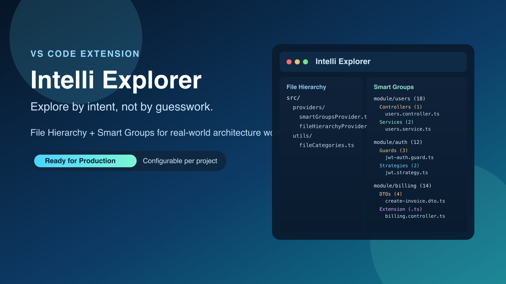
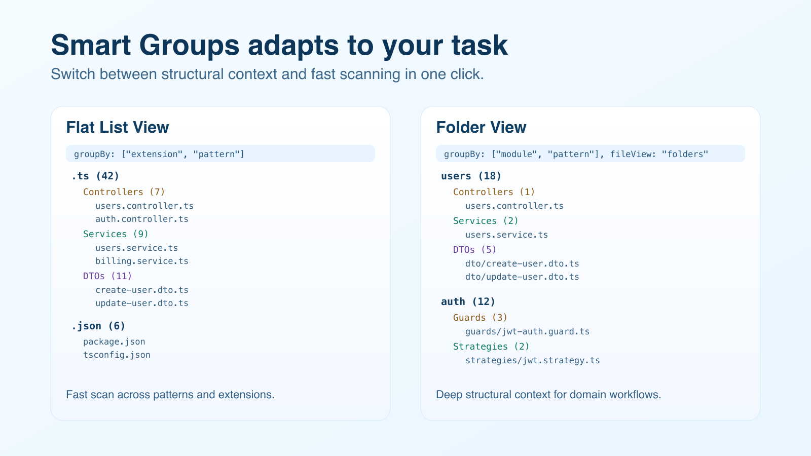
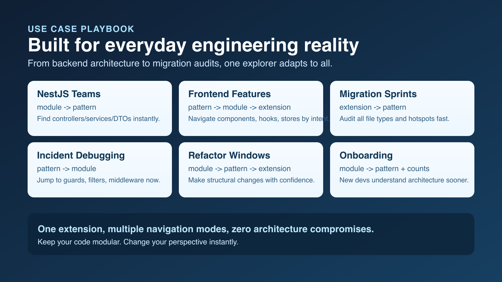
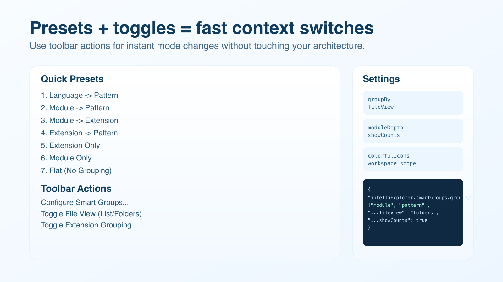

# Intelli Explorer

[](https://github.com/Joangeldelarosa/intelli-explorer/actions/workflows/ci.yml)
[](https://code.visualstudio.com/)
[](LICENSE)


Intelli Explorer is a VS Code extension for teams that need faster file navigation in growing codebases.

It gives you two complementary views:

- File Hierarchy for the real folder structure.
- Smart Groups for semantic grouping by language, pattern, module, and extension.



## Why This Extension Matters

As projects scale, the default explorer becomes slower for intent-based navigation.

Common pain points:

- You know the kind of file you need, but not where it lives.
- You need all controllers, DTOs, guards, or tests across modules now.
- You are migrating by extension and must locate hotspots quickly.
- New team members struggle to map architecture from folder names only.

Intelli Explorer keeps your architecture modular while giving you multiple navigation perspectives.

## Visual Product Tour

### Smart Groups: Flat vs Folder Presentation



### Real Engineering Use Cases



### Presets and Project-Level Personalization



## Core Features

### 1) File Hierarchy

A classic tree view for exact filesystem navigation.

Best for:

- Creating and moving files in known folders.
- Verifying relative structure quickly.
- Infra/config workflows where physical path context is critical.

### 2) Smart Groups

A configurable tree that reorganizes files by intent.

Supported dimensions:

- language
- pattern
- module
- extension

Supported file presentations:

- flat
- folders

Additional visual controls:

- counts per group/folder
- themed icon accents for faster scanning

## Built-In Presets

Use Configure Smart Groups... in the Smart Groups toolbar to switch instantly:

- Language -> Pattern
- Module -> Pattern
- Module -> Extension
- Extension -> Pattern
- Extension Only
- Module Only
- Flat (No Grouping)

## Use Case Playbook

| Scenario | Recommended Setup | Result |
| --- | --- | --- |
| NestJS backend | groupBy: ["module", "pattern"], fileView: "folders" | Controllers/services/DTOs are discoverable in seconds |
| Frontend feature work | groupBy: ["pattern", "module", "extension"] | Components/hooks/stores organized by intent |
| Incident response | groupBy: ["pattern", "module"] | Guards/middleware/interceptors located fast |
| Migration sprint | groupBy: ["extension", "pattern"], fileView: "flat" | Rapid extension-level audits and refactor planning |
| Onboarding | groupBy: ["module", "pattern"], showCounts: true | New developers map architecture sooner |
| Monorepo scanning | groupBy: ["module", "pattern"], moduleDepth: 2 | Better package/domain-level navigation |

## Commands

| Command | ID | What It Does |
| --- | --- | --- |
| Refresh | intelliExplorer.refresh | Reloads both views |
| Open File | intelliExplorer.openFile | Opens selected file |
| Reveal in Native Explorer | intelliExplorer.revealInNativeExplorer | Opens file in OS explorer/finder |
| Configure Smart Groups... | intelliExplorer.configureSmartGroups | Applies a grouping preset |
| Toggle File View (List/Folders) | intelliExplorer.toggleSmartFileView | Switches flat/folder presentation |
| Toggle Extension Grouping | intelliExplorer.toggleExtensionGrouping | Adds or removes extension grouping |

## Configuration Reference

All settings can be saved per project in .vscode/settings.json.

| Setting | Type | Default | Description |
| --- | --- | --- | --- |
| intelliExplorer.smartGroups.groupBy | array | ["language", "pattern"] | Grouping order. Values: language, pattern, module, extension. Max 3. Use [] for no grouping. |
| intelliExplorer.smartGroups.fileView | string | "flat" | File rendering mode: flat or folders. |
| intelliExplorer.smartGroups.moduleDepth | number | 1 | Folder depth used when grouping by module. Range: 1 to 6. |
| intelliExplorer.smartGroups.showCounts | boolean | true | Shows counts in groups/folders. |
| intelliExplorer.smartGroups.colorfulIcons | boolean | true | Enables themed icon/decorator accents. |

### Example: Production-Friendly Workspace Profile

```json
{
  "intelliExplorer.smartGroups.groupBy": ["module", "pattern"],
  "intelliExplorer.smartGroups.fileView": "folders",
  "intelliExplorer.smartGroups.moduleDepth": 1,
  "intelliExplorer.smartGroups.showCounts": true,
  "intelliExplorer.smartGroups.colorfulIcons": true
}
```

### Example: Migration/Audit Profile

```json
{
  "intelliExplorer.smartGroups.groupBy": ["extension", "pattern"],
  "intelliExplorer.smartGroups.fileView": "flat",
  "intelliExplorer.smartGroups.moduleDepth": 1,
  "intelliExplorer.smartGroups.showCounts": true,
  "intelliExplorer.smartGroups.colorfulIcons": true
}
```

## Supported Pattern Categories

Smart Groups includes broad pattern detection, including:

- Controllers, Services, Models, Interfaces, DTOs, Repositories
- Middleware, Guards, Pipes, Interceptors, Decorators, Filters
- Modules, Routes, Components, Pages, Layouts, Hooks
- Stores, Actions, Reducers, Selectors, Effects, Sagas
- Utils, Constants, Config, Validators, Schemas, Enums
- Migrations, Seeds, Factories, Events, Jobs, Commands, Queries, Handlers

## Supported Language Categories

Out-of-the-box coverage includes:

- TypeScript/TSX
- JavaScript/JSX/MJS/CJS
- CSS/SCSS/SASS/Less/Stylus
- HTML/XML/SVG
- JSON/YAML/TOML/INI/ENV
- Python, Go, Rust, Java, Kotlin, C/C++, C#, PHP, Ruby
- Shell scripts
- Markdown/Text docs
- SQL, GraphQL, Prisma, Proto

Unknown extensions are still grouped into readable fallback categories.

## Installation

### From VS Code Marketplace

1. Open Extensions (Ctrl+Shift+X / Cmd+Shift+X).
2. Search Intelli Explorer.
3. Install.

### From VSIX

```bash
code --install-extension intelli-explorer-0.1.0.vsix
```

### Build From Source

```bash
git clone https://github.com/Joangeldelarosa/intelli-explorer.git
cd intelli-explorer
npm install
npm run compile
npm run package
code --install-extension intelli-explorer-0.1.0.vsix
```

After install, run Developer: Reload Window.

## Quick Start Flow

1. Open Intelli Explorer in Activity Bar.
2. Keep File Hierarchy for path-based navigation.
3. Open Smart Groups and choose Configure Smart Groups....
4. Pick preset based on your current task.
5. Toggle List/Folders depending on context density.
6. Toggle Extension Grouping during migration or audit moments.

## Visual Brand Assets

These assets are generated and versioned in-repo:

- resources/brand-icon.svg
- resources/icon.png
- resources/activitybar-icon.svg
- docs/assets/*.png

Regenerate with:

```bash
npm run assets:build
```

## Development

### Prerequisites

| Tool | Version |
| --- | --- |
| Node.js | >= 18 |
| npm | >= 9 |
| VS Code | >= 1.85 |

### Setup

```bash
git clone https://github.com/Joangeldelarosa/intelli-explorer.git
cd intelli-explorer
npm install
```

### Common Scripts

```bash
npm run compile
npm run watch
npm run lint
npm test
npm run icon:png
npm run assets:build
npm run package
npm run clean
```

### Debugging

1. Open project in VS Code.
2. Press F5 to launch Extension Development Host.
3. Keep watch mode running for rapid iteration.

## Performance Notes

- File scanning excludes heavy directories (node_modules, .git, out, dist, build).
- Refresh is debounced to avoid noisy rebuilds.
- Groups update on file create/change/delete events.

## Security and Privacy

- Intelli Explorer runs locally in VS Code.
- No external service is required for core grouping/navigation behavior.
- No telemetry pipeline is required for core operation.

## Troubleshooting

### Smart Groups is empty

- Ensure a workspace folder is open.
- Ensure files have extensions.
- Run Refresh.

### Colors are not obvious in my theme

- Ensure intelliExplorer.smartGroups.colorfulIcons is true.
- Try a higher-contrast theme for stronger icon visibility.

### I want a single grouping mode only

```json
{
  "intelliExplorer.smartGroups.groupBy": ["module"]
}
```

### I want no grouping

```json
{
  "intelliExplorer.smartGroups.groupBy": [],
  "intelliExplorer.smartGroups.fileView": "flat"
}
```

## CI/CD

CI validates lint, compile, and tests on push/PR.
Release workflow packages VSIX and can publish to Marketplace with configured credentials.

## Contributing

See CONTRIBUTING.md for contribution and workflow guidelines.

## License

MIT © Joangel de la Rosa
